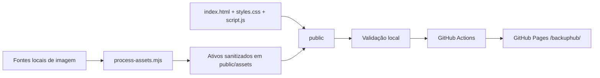

# Arquitetura

## Decisão estrutural

O site usa HTML, CSS e JavaScript nativos. Não há framework, build obrigatório,
backend, persistência ou dependência carregada no navegador.

## Camadas

### Apresentação

- `public/index.html`: semântica, conteúdo, SEO e contratos de interação;
- `public/styles.css`: identidade visual e comportamento adaptativo;
- `public/script.js`: menu mobile e lightbox.

### Ativos

- `Logo-icone/` e `Screenshots/`: fontes locais ignoradas;
- `public/assets/`: derivados públicos;
- `tools/process-assets.mjs`: redimensionamento, sanitização e conversão.

### Desenvolvimento

- `tools/dev-server.mjs`: servidor HTTP local;
- `tools/check-site.mjs`: integridade do pacote público;
- `tools/check-docs.mjs`: presença e links da documentação;
- `html-validate`: validação estrutural dos documentos HTML.

### Entrega

- `.github/workflows/pages.yml`: validação e publicação;
- somente `public/` compõe o artefato do GitHub Pages.

## Fluxo de requisição

No ambiente publicado, o GitHub Pages entrega arquivos estáticos. Localmente,
`npm run dev` aceita somente `GET` e `HEAD`, restringe resolução a `public/`,
envia tipos MIME conhecidos e simula tanto `/` quanto `/backuphub/`.

## Estado e persistência

O único estado transitório é o estado visual do menu e do `dialog`. Não há
`localStorage`, `sessionStorage`, IndexedDB, cookies ou chamadas de rede
programadas pelo site.

## Dependências

As dependências são exclusivamente de desenvolvimento:

| Pacote | Finalidade |
|---|---|
| `html-validate` | validar HTML |
| `sharp` | processar e converter imagens |

Nenhum desses pacotes é enviado ou executado no navegador do visitante.

## Pontos de extensão

Qualquer introdução de framework, backend, API, analytics, formulário,
pagamento ou persistência altera a arquitetura e exige novo ADR, análise de
segurança, política de privacidade e estratégia de rollback.

